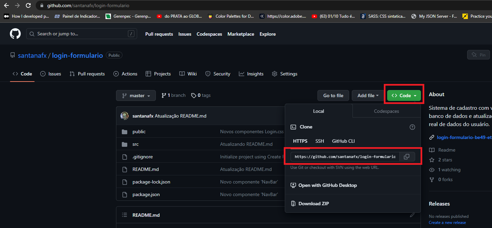

## Tecnologias e linguagens utilizadas

**Typescript** | **ReactJS** | **Vite**

Para o desenvolvimento do projeto, foram escolhidas as seguintes tecnologias:

1. `ReactJS`, que é uma ferramenta amplamente utilizada do JavaScript para a construção de interfaces de usuário interativas e performáticas
2. `Vite`, uma ferramenta conhecida por sua velocidade e eficiência no desenvolvimento
3. `TypeScript`, que adiciona tipagem opcional ao JavaScript, proporcionando maior facilidade na manutenção, robustez ao código, melhor legibilidade e redução de bugs.

## Video do projeto

<a href="https://youtu.be/_uzIHHMV9Lo">Video do projeto aqui</a>.

#### Imagens

  
  

## Bibliotecas utilizadas

1. `react-router-dom` - biblioteca que permite desenvolver aplicativos utilizando single page aplication.
2. `react-use-websocket` - biblioteca que permite realizar a conexão com websocket.
3. `react-icons` - biblioteca que permite o uso de icones.
4. `react-redux` - biblioteca que permite o gerenciamento de estado entre o Redux e React.
5. `@reduxjs/toolkit` - biblioteca que simplifica e otimiza todo o processo de gerenciamento de estado que utilizam o Redux.

#### Objetivo

No desafio foram fornecidas as seguintes instruções:

1. Utilizar ReactJS para construir a interface do usuário.
2. Implementar uma visualização responsiva, adequada para desktops e dispositivos móveis.
3. Utilizar Websockets para conectar-se à API da Binance e obter atualizações em tempo real dos preços das criptomoedas: Bitcoin (BTC),Ethereum (ETH), Solana(SOL) e Dogecoin (DOGE).
4. Exibir o último preço em USDT para cada uma das criptomoedas.
5. Calcular e mostrar o percentual de mudança do preço desde a abertura do dashboard para cada criptomoeda.
6. Atualizar estes dados em tempo real conforme as novas informações são recebidas via Websocket.
7. Usar o Redux para gerenciar o estado da aplicação, incluindo os preços das criptomoedas e os valores percentuais de mudança.
8. Garantir que o dashboard seja capaz de processar e exibir atualizações de preços em tempo real sem lag perceptível.
9. Implementar tratamento adequado de reconexão para o caso de perdas temporárias na conexão com a API da Binance.

## Estrutura do projeto

O projeto foi organizado em pastas, cada uma destinada a um elemento específico de acordo com sua função:

`./src/assets`: Armazena os arquivos de imagem do projeto.
`./src/components`: Segue a metodologia do Atomic Design, permitindo a criação de um sistema mais consistente e padronizado.
`./src/global.css`: Contém o CSS utilizado de forma global nos componentes.
`./src/store`: Contém os arquivos para o gerenciamento de estado de várias variáveis utilizando o Redux.
`./src/layout/Layout.tsx`: Contém o layout padrão da aplicação, incluindo componentes como Logo e Footer.
`./src/pages`: Contém as pastas com os componentes das páginas.
`./src/services/services.ts`: Contém todos os endpoints utilizados para realizar requisições à API da Binance, com gerenciamento realizado pelo Redux.
`./src/types/types.ts`: Contém os tipos comuns compartilhados entre vários componentes.

## Fluxo de Inicialização

Ao iniciar o projeto, a página `<Home>` é carregada junto com o `<Layout>`, renderizando assim os componentes `<Logo>` e `<Footer>`. Na página `<Home>`, são carregados seus componentes filhos `<CryptoList>`, `<NavMenu>` e `<TickerInfo>`. Neste ponto, o componente `<CryptoList.Item>` se conecta ao websocket da Binance e armazena a resposta no reducer `./src/store/reducers/cryptoInfo.ts`. O valor armazenado no reducer é então utilizado para realizar os cálculos necessários para obter o preço atual e o percentual de mudança do preço desde a abertura do dashboard para cada criptomoeda.

## Funcionalidade de Busca

O projeto inclui um input onde o usuário pode procurar por qualquer criptoativo desejado. O componente `<SearchInput>` auxilia o usuário na busca, exibindo uma lista que filtra os criptoativos que começam com as letras digitadas pelo usuário no input, facilitando a busca pelo ativo. Quando o usuário encontra o criptoativo, pode clicar na lista ou pressionar a tecla Enter para que o componente `<TickerInfo>` exiba informações relevantes sobre o criptoativo selecionado.

## Funcionalidades Adicionais

O projeto também inclui um widget do TradingView com várias funcionalidades para exibir informações de qualquer ativo.

## Como me localizar no projeto?

- Todos os componentes do projeto são renderizados em `./src/App`.
  - Todos os componentes podem ser encontrados na pasta `./src/components`
    - Uma vez dentro do arquivo `./src/App` você pode navegar pelos componentes e realizar as alterações desejadas.

## Como instalar

Para preparar o ambiente, precisaremos ter algumas coisas instaladas no computador, sendo elas:

Node.js
<a href="https://nodejs.org/pt-br">Clique aqui para instalar o Node.js</a>.

Para instalar o Node, clique no link e baixe a versão LTS (versão recomendada)
Para verificar se foi instalado corretamente, abra o terminal e escreva node -v ou node --version
alt text: site do Nodejs, com o botão da versão recomendada em foco por um quadrado vermelho!

Git
<a href="https://git-scm.com/download/windows">Clique aqui para instalar o Git</a>.

Caso não tenha um terminal de preferência, recomendo utilizar o git bash. Para instalá-lo, haverá uma opção durante a instalação do git para permitir instalar o git bash
alt text: imagem mostrando várias caixas selecionáveis. A caixa “Git Bash Here” está em evidência por um quadrado vermelho com uma seta apontada para ele

Para verificar se o git foi instalado corretamente, abra o terminal e escreva git --version
Visual Studio Code

Entre no link e baixe a versão de Windows.

<a href="https://code.visualstudio.com/download">Clique aqui para instalar o Visual Studio</a>.

Clique com o botão direito em algum local do computador e selecione a opção Git Bash Here.

Escreva no terminal o comando abaixo e no lugar de 'cole aqui' entre no projeto do GitHub e cole o link do projeto.

git clone 'cole aqui o link do projeto'

Uma pasta com o projeto desejado será adicionada a pasta em que foi escolhida.
Clique com o botão direito em cima da pasta e selecione "Abrir com Code"

Uma vez que o Visual studio estiver aberto com o projeto desejado, abra o terminal clicando no menu da aba superior e digite no terminal aberto o código "npm install" e logo em seguida digite "npm run dev". Uma janela do browser será aberta e o projeto será iniciado em seu computador.

 

# :sunglasses: Autor 

 

Lucas Santana Figueiredo

 
  
  
  

